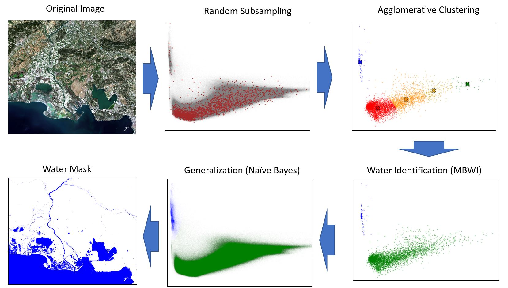

# WaterDetect

[](https://zenodo.org/badge/latestdoi/224832878)

## Synopsis

WaterDetect is an end-to-end algorithm to generate open water cover mask, specially conceived for L2A Sentinel 2 imagery from [MAJA](https://logiciels.cnes.fr/en/content/maja)<sup>1</sup>  processor, without any a priori knowledge on the scene. It can also be used for Landsat 8 images and for other multispectral clustering/segmentation tasks.<br>

The water masks produced by WaterDetect were primarily designed for water quality product computation (Obs2Co processing chain) and are also used for multi-temporal water maps (Surfwater processing chain). Both chains are supported by the "SWOT-Downstream" and TOSCA programs by CNES. Products are provided by the THEIA / Hydroweb-NG platform. 

The WaterDetect algorithm uses a multidimensional agglomerative clustering technique on a subsample of the scene's pixels, to group them in classes, and a naive bayes classifier to generalize the results for the whole scene, as summarized in the following picture:



All the details and tests has been described in the article <b>Automatic Water Detection from Multidimensional Hierarchical Clustering for Sentinel-2 Images and a Comparison with Level 2A Processors</b>, under revision by the journal Remote Sensing of Environment.

## How to cite
Cordeiro, M. C. R.; Martinez, J.-M.; Peña-Luque, S. Automatic Water Detection from Multidimensional Hierarchical Clustering for Sentinel-2 Images and a Comparison with Level 2A Processors. Remote Sensing of Environment 2021, 253, 112209. https://doi.org/10.1016/j.rse.2020.112209.

## Changelog

### Release 1.5.9
- Added external mask processing through the command `process_ext_masks`. It prepares an external mask (ex. created by FMask) to be used by WaterDetect.

### Release 1.5.8
- correct GlintMode to work on S2_THEIA images
- Add calculation of MBWI index inside DWImageClustering class

### Release 1.5.7 
- new entry point runWaterDetect.py 
- Namespace correction for different versions of sklearn package 
- New treatment for negative reflectance values (individual pixel correction)
- Added regularization option to avoid extreme values on Normalized Difference indices.
- New water cluster detection method based on lowest Nir reflectance ("minnir")
- Updated reporting. Invalid mask is superimposed to the RGB scene representation
- Added support for Sen2Cor internal masks
- GLINT mode (For entire scenes only). Creates a Glint heatmap based on viewing and solar angles and updates the thresholds to include waters with sun glint in the final mask


## Tutorial
The following topics have the first steps to install and run the library. For a more comprehensive tutorial with code samples and results please refer to this tutorial https://cordmaur.medium.com/water-detection-in-high-resolution-satellite-images-using-the-waterdetect-python-package-7c5a031e3d16.

## Supported Formats
The algorithm has been developed taking into account atmospherically corrected images from MAJA, as described in the paper. However other image formats are also supported.
To the present, the following image formats are supported:
* Sentinel 2 - L2A from MAJA: the products can be downloaded from (https://www.theia-land.fr/en/product/sentinel-2-surface-reflectance/)
* Sentinel 2 - L2A from Sen2Cor: The L2A processed by Sen2Cor are available at Copernicus SciHub (https://scihub.copernicus.eu/)
* Sentinel 2 - L1C: L1C Sentinel 2 images can be downloaded from Copernicus SciHub (https://scihub.copernicus.eu/)
* Landsat 8 - To be validated

## Dependencies
The required libraries are:
```
GDAL>=3.0.2
matplotlib>=3.1.2
PyPDF2>=1.26.0
scipy>=1.3.2
scikit-learn>=0.22
skikit-image>=0.16.2
numpy>=1.17
PIL>=8.0
lxml>=4.5
```
### Note 1:
GDAL is required to open the satellite images. It's still possible to use without GDAL, from a python console or jupyter notebook, loading the rasters manually and passing all the necessary bands to the DWImageClustering class. Check the topic "Usage from Console" for more information.

### Note 2:
Scikit-Image is only necessary to run Otsu threshold method. 

The test_dependencies.py can be used to check if all libraries are loading correctly. Simply run:


## Instalation
The easiest way to install waterdetect package is with `pip` command:<br>
`pip install waterdetect`

Alternatively, you can clone the repository and install from its root throught the following commands:
```
git clone https://github.com/cordmaur/WaterDetect.git
cd WaterDetect
pip install .
```

Once installed, a `waterdetect` entry point is created in the path of the environment.
One can check the installation and options by running `waterdetect --help`. If GDAL is not found, a message will raise indicating that waterdetect will only run from a console.
```
usage: waterdetect [-h] [-GC] [-i INPUT] [-o OUT] [-s SHP] [-p PRODUCT]
                   [-c CONFIG]

The waterdetect is a high speed water detection algorithm for satellite
images. It will loop through all images available in the input folder and
write results for every combination specified in the .ini file to the output
folder. It can also run for single images from Python console or Jupyter
notebook. Refer to the onlinedocumentation

optional arguments:
  -h, --help            show this help message and exit
  -GC, --GetConfig      Copy the WaterDetect.ini from the package into the
                        specifieddirectory and skips the processing. Once
                        copied you can edit the .ini file and launch the
                        waterdetect without -c option.
  -i INPUT, --input INPUT
                        The products input folder. Required.
  -o OUT, --out OUT     Output directory. Required.
  -s SHP, --shp SHP     SHP file. Optional.
  -p PRODUCT, --product PRODUCT
                        The product to be processed (S2_THEIA, L8_USGS, S2_L1C
                        or S2_S2COR)
  -c CONFIG, --config CONFIG
                        Configuration .ini file. If not specified
                        WaterDetect.ini from current dir and used as default

To copy the package's default .ini file into the current directory, type:
`waterdetect -GC .` without other arguments and it will copy WaterDetect.ini
into the current directory.
```

### Config File
The waterdetect needs a config file that specifies the bands used in the clustering process as well as other parameters.
To obtain the default version of this file,  one can use `waterdetec -GC` and the file WaterDetect.ini will be copied into the current working folder.

## Usage as Script
The basic usage for the waterdetect is:<br>
`waterdetect -i c:/input_folder -i -c:/output_folder -p S2_THEIA`

The input directory should contain the uncompressed folders for the images. The script will loop through all folders in the input directory and save the water masks, graphs and reports to the output folder. The output folder must be created beforehand.

If the config file is not specified, the script will search for WaterDetect.ini in the current folder.

## Usage from Console
Once properly installed, the WaterDetect can be run from a console or a Jupyter Notebook, by import the package and calling DWDetectWater.

```
>>> import waterdetect as wd
>>> !waterdetect -GC
>>> wd.DWWaterDetect.run_batch(input_folder='D:\Images\Input\',
                               output_folder='D:\Images\Output',
                               shape_file='D:\Shp\SomeShapefile.shp',
                               product=wd.DWProducts.Sentinel2_THEIA,
                               config_file='WaterDetect.ini'
                              )
```
For more information on how to use it from jupyter notebook, in batch or single mode or to use it with other satellite images or without GDAL, please refer to the <b>tutorial</b> available here https://towardsdatascience.com/water-detection-in-high-resolution-satellite-images-using-the-waterdetect-python-package-7c5a031e3d16.

## Contributors
> Author: Maurício Cordeiro (ANA/GET)<br>
> Supervisor: Jean-Michel Martinez (IRD/GET)<br>
> Validation dataset: Santiago Pena Luque (CNES) 

### Institutions
* ANA - Agência Nacional de Águas (https://www.gov.br/ana/en/)
* GET - Géosciences Environnement Toulouse (https://www.get.omp.eu/)
* IRD - Institut de Recherche pour le Développement (https://en.ird.fr/)
* CNES - Centre National d'Études Spatiales (https://cnes.fr/fr)

## License
This code is licensed under the [GNU General Public License v3.0](https://github.com/cordmaur/WaterDetect/blob/master/LICENSE) license. Please, refer to GNU's webpage  (https://www.gnu.org/licenses/gpl-3.0.en.html) for details.

## Reference
(1) Hagolle, O.; Huc, M.; Pascual, D. V.; Dedieu, G. A Multi-Temporal Method for Cloud Detection, Applied to FORMOSAT-2, VENµS, LANDSAT and SENTINEL-2 Images. Remote Sensing of Environment 2010, 114 (8), 1747–1755. https://doi.org/10.1016/j.rse.2010.03.002.

(2) Cordeiro, M. C. R.; Martinez, J.-M.; Peña-Luque, S. Automatic Water Detection from Multidimensional Hierarchical Clustering for Sentinel-2 Images and a Comparison with Level 2A Processors. Remote Sensing of Environment 2021, 253, 112209. https://doi.org/10.1016/j.rse.2020.112209.

